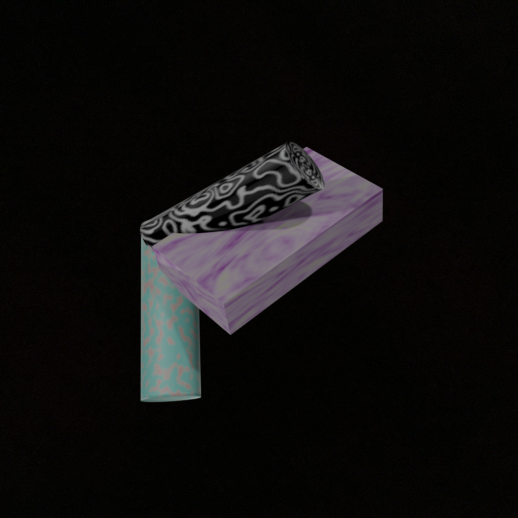
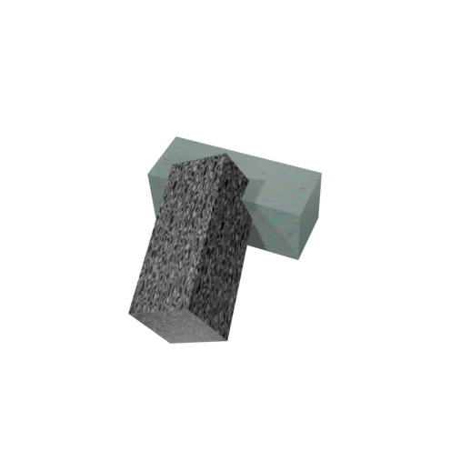
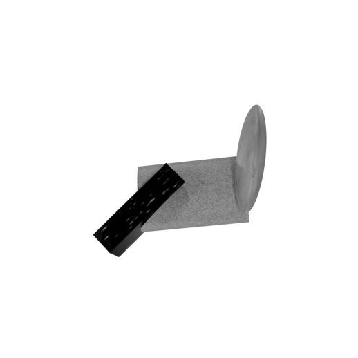
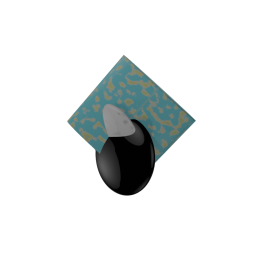
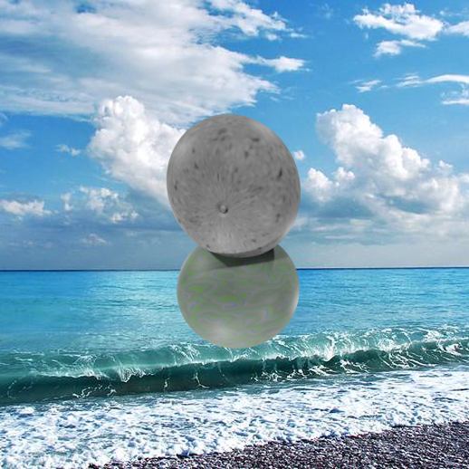
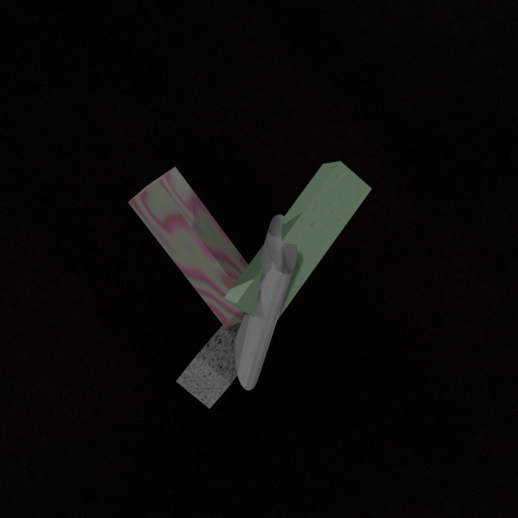
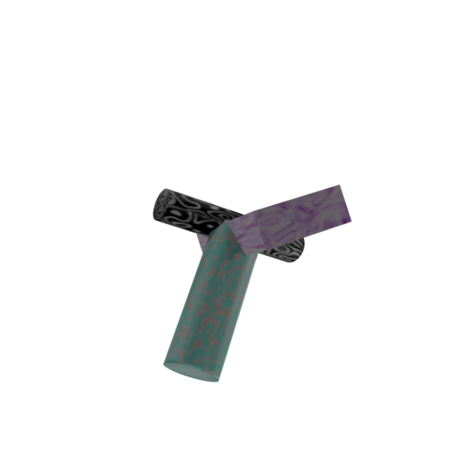

# HIDA Data Generation - Object Generation & Rendering Guide

This directory contains scripts for generating and rendering two types of 3D objects for the HIDA (Human Inspired Data Augmentations) dataset:
1. **Shapegen**: Procedurally generated abstract shapes
2. **Primigen**: Primitive compositions with controlled variations

## Gallery of Primigen objects

<p align="center">
  
  
  
  
</p>
<p align="center">
  
  
  
  
</p>
<p align="center">
  
  
  
  
</p>

## Quick Start

**Use the unified pipeline for easy generation:**

```bash
# Quick test (minimal dataset, ~10 minutes)
./quickstart.sh --preset test

# Full production dataset (several hours)
./quickstart.sh --preset full --output my_dataset

# Or use the Python interface directly
python hida_generate.py --output my_dataset --n-shapes 100
```

The unified pipeline automatically:
- Generates Fibonacci sphere viewpoints
- Creates procedural textures
- Generates Shapegen and/or Primigen objects
- Renders from multiple viewpoints
- Saves reproducible configuration

See [Unified Pipeline](#unified-pipeline) for details.

---

## Table of Contents
- [Quick Start](#-quick-start)
- [Unified Pipeline](#unified-pipeline) **← New! Easiest way to use**
- [Utility Scripts](#utility-scripts)
  - [Viewpoint Generation](#viewpoint-generation)
  - [Texture Generation](#texture-generation)
- [Prerequisites](#prerequisites)
- [Directory Structure](#directory-structure)
- [Shapegen Pipeline](#shapegen-pipeline)
  - [Object Generation](#shapegen-object-generation)
  - [Rendering](#shapegen-rendering)
  - [Similarity Computation & Binning](#shapegen-similarity-computation--binning)
- [Primigen Pipeline](#primigen-pipeline)
  - [Generation Algorithm](#primigen-generation-algorithm)
  - [Object Generation](#primigen-object-generation)
  - [Rendering](#primigen-rendering)
- [Background Addition](#background-addition)
- [Common Parameters](#common-parameters)
- [Examples](#examples)
- [Quick Reference Card](#quick-reference-card)
- [Troubleshooting & FAQ](#troubleshooting--faq)

---

## Unified Pipeline

The **`hida_generate.py`** script provides a streamlined interface for the entire data generation pipeline.


### Basic Usage

```bash
# Generate everything with defaults
python hida_generate.py --output my_dataset

# Generate only Shapegen
python hida_generate.py --output my_dataset --no-primigen

# Generate only Primigen
python hida_generate.py --output my_dataset --no-shapegen

# Custom configuration
python hida_generate.py --output my_dataset \
  --n-shapes 200 \
  --n-primitives 2 3 \
  --n-viewpoints 100 \
  --n-lights 16
```

```bash
./quickstart.sh --preset test
./quickstart.sh --preset full --output production_data
```

### Advanced Options

```bash
python hida_generate.py \
  --output my_dataset \
  --n-shapes 100 \                    # Shapegen: shapes per smoothness
  --extrusions 9 \                     # Shapegen: extrusion complexity
  --smoothness-levels 2 \              # Shapegen: smoothness variations
  --n-primitives 2 3 4 \               # Primigen: n-levels to generate
  --n-configs 6 \                      # Primigen: configs per n-level
  --n-warps 6 \                        # Primigen: warps per config
  --n-placements 15 \                  # Primigen: placements per warp
  --n-viewpoints 50 \                  # Rendering: viewpoints per object
  --n-lights 8 \                       # Rendering: number of lights
  --textures /path/to/existing \       # Use existing textures
  --viewpoints-file /path/to/pts.pkl   # Use existing viewpoints
```

### Output Structure

```
my_dataset/
├── viewpoints/
│   └── 50_points.pkl                # Generated viewpoints
├── textures/
│   ├── texture_000.png              # Generated textures
│   └── ...
├── shapegen_objects/
│   └── extrusions_9/
│       ├── blocky/
│       └── smooth/
├── shapegen_renders/
│   └── extrusions_9/
│       └── blocky/
│           └── shape_blocky_000/
│               ├── 000.png - 049.png
│               └── ...
├── primigen_objects/
│   ├── n2/
│   ├── n3/
│   └── n4/
├── primigen_renders/
│   └── ...
└── pipeline_config.json             # Reproducible configuration
```

---

## Utility Scripts

### Viewpoint Generation

**`utils/compute_sphere.py`** generates evenly distributed camera viewpoints using the Fibonacci spiral method.

```bash
# Generate 50 viewpoints
python utils/compute_sphere.py 50 --output viewpoints/50_points.pkl

# Generate 100 viewpoints with randomization
python utils/compute_sphere.py 100 --output viewpoints/100_points.pkl --randomize
```

**How it works:**
- Uses the **Fibonacci spiral** (golden ratio) for optimal point distribution
- Ensures even coverage across the sphere surface
- Optional randomization for slight jittering
- Outputs viewpoints as `(x, y, z)` tuples on unit sphere

**Output:** Pickle file containing list of normalized 3D coordinates

### Texture Generation

**`utils/create_textures.py`** creates procedural textures using Blender's shader nodes.

```bash
# Generate 100 textures per category (400 total)
blender --background --python utils/create_textures.py -- 100

# Generate minimal set for testing
blender --background --python utils/create_textures.py -- 10
```

**Texture Types:**
1. **Noise Texture**: Organic, cloud-like patterns
2. **Voronoi Texture**: Cellular patterns (F1, F2 features)
3. **Wave Texture**: Bands and rings with various profiles
4. **Musgrave Texture**: Fractal patterns (FBM, Multifractal, etc.)

**Features:**
- Randomized parameters for each texture
- Mix of black & white and colored versions
- Controllable resolution (default: 512×512)
- Uses Blender Cycles for high-quality rendering

**Output:** PNG files in `texture_exports/` directory

---

## Prerequisites

### Required Software
- **Blender 3.6+** (tested with 3.6.19)
- **Python 3.8+** with packages:
  ```bash
  pip install numpy scipy scikit-learn tqdm matplotlib seaborn Pillow opencv-python
  ```

### Optional Assets (Auto-generated by unified pipeline)
- **Texture folder**: Directory containing `.png` texture files
  - Can be auto-generated using `utils/create_textures.py`
- **Fibonacci sphere viewpoints**: Pickle file with pre-computed viewpoints
  - Can be auto-generated using `utils/compute_sphere.py`
- **Shape generator addon**: Blender addon located in `Shapegen/shape_generator/`
  - Required only for Shapegen generation

---

## Directory Structure

```
HIDA_data_generation/
├── hida_generate.py              # Unified pipeline interface
├── quickstart.sh                 # Quick start with presets
├── README.md                     # This file
├── utils/                        # Utility scripts
│   ├── compute_sphere.py         #     Generate viewpoints
│   └── create_textures.py        #     Generate textures
├── examples/                     # Example scripts
│   ├── minimal_example.sh        #     Quick test example
│   └── README.md                 #     Examples documentation
├── Shapegen/
│   ├── shape_generator/          # Blender addon for procedural shapes
│   │   ├── operators.py
│   │   └── ...
│   ├── Object_generation/
│   │   └── generate_stim_final_w_pkl.py  # Main generation script
│   ├── Rendering/
│   │   ├── render_simplified.sh          # Rendering script
│   │   └── background_adding.py          # Add backgrounds to renders
│   └── Sim_calculations/
│       ├── precompute_valid_pairs.py     # Compute valid image pairs
│       └── precomputed_sim.py            # Similarity calculation
│
└── Primigen/
    ├── Object_generation/
    │   ├── primishapegen_v2.py           # Main generation script
    │   └── generate_primigen.sh          # Batch generation script
    └── Rendering/
        ├── render_simplified.sh          # Rendering script
        └── background_adding.py          # Add backgrounds to renders
```

---

## Shapegen Pipeline

### Shapegen Object Generation

Shapegen creates **procedurally generated abstract shapes** using Blender's shape_generator addon. Each shape is defined by:
- **Extrusions**: Number of extrusion operations (controls complexity)
- **Subdivisions**: Smoothness level (0 = blocky, 5 = very smooth)
- **Axis preferences**: Directional bias for extrusions
- **Random seeds**: For reproducibility

#### Basic Usage

```bash
cd Shapegen/Object_generation

# Generate shapes with custom parameters
blender --background --python generate_stim_final_w_pkl.py -- \
  --output generated_shapes \
  --n_shapes 100 \
  --n_extrusions 9 \
  --smoothness_levels 2 \
  --textures /path/to/textures
```

#### Key Parameters

| Parameter | Description | Default | Range |
|-----------|-------------|---------|-------|
| `--output` | Output directory | `./generated_shapes` | - |
| `--n_shapes` | Shapes per smoothness level | 5 | 1-1000+ |
| `--n_extrusions` | Extrusion operations | Varies | 2-9 |
| `--smoothness_levels` | Number of smoothness variations | 2 | 1-6 |
| `--textures` | Texture directory path | None | - |
| `--preview` | Generate preview set (all extrusions × smoothness) | False | - |

#### Preview Mode

Preview mode generates shapes across **all combinations** of extrusions (2-9) and smoothness (0-5):

```bash
blender --background --python generate_stim_final_w_pkl.py -- \
  --preview \
  --output preview_shapes
```

This creates:
- 8 extrusion levels × 2 smoothness levels = 16 combinations
- 100 shapes per combination = 1,600 total shapes

#### Output Structure

```
generated_shapes/
├── extrusions_9/
│   ├── blocky/                  # smoothness_0
│   │   ├── shape_blocky_000.blend
│   │   ├── shape_blocky_001.blend
│   │   └── ...
│   └── smooth/                  # smoothness_5
│       ├── shape_smooth_000.blend
│       └── ...
└── stimulus_info.pkl           # Parameter metadata
```

---

### Shapegen Rendering

Renders generated shapes from multiple viewpoints with configurable lighting.

#### Basic Usage

```bash
cd Shapegen/Rendering

./render_simplified.sh \
  /path/to/generated_shapes \
  /path/to/output_images \
  --8_lights \
  --random_dim \
  --sphere=true \
  --sphere_file=/path/to/50_points.pkl \
  --scale_camera=true
```

#### Rendering Modes

**1. Fibonacci Sphere Mode** (Recommended)
```bash
--sphere=true --sphere_file=/path/to/50_points.pkl
```
- Renders from pre-computed evenly distributed viewpoints
- Ensures consistent viewpoint distribution across objects
- Default: 50 viewpoints per object

**2. Random Mode**
```bash
# Don't specify --sphere
```
- Generates 10 random camera positions per object
- Camera positions satisfy angular constraints

**3. Video Mode**
```bash
--video=true
```
- Creates a 360° rotating video
- 80 frames at 20 fps = 4 seconds

**4. Preview Mode**
```bash
--preview
```
- Generates 3 variations:
  - `camera_light/`: Both camera and lights vary (5 images)
  - `light/`: Fixed camera, varying lights (5 images)
  - `camera/`: Varying camera, fixed lights (5 images)

#### Lighting Options

| Parameter | Description | Options |
|-----------|-------------|---------|
| `--4_lights` / `--6_lights` / `--8_lights` / `--16_lights` | Number of lights | Choose one |
| `--random_dim` | Randomize light intensities | Boolean |
| `--light_colors` | Light color | `white`, `red`, `random`, etc. |

#### Camera Options

| Parameter | Description | Default |
|-----------|-------------|---------|
| `--scale_camera=true/false` | Auto-scale camera based on object size | false |
| `--sphere_file` | Path to viewpoint file | Required for sphere mode |

#### Output Structure

```
output_images/
├── extrusions_9/
│   └── blocky/
│       └── shape_blocky_000/
│           ├── 000.png
│           ├── 001.png
│           ├── ...
│           └── 049.png          # 50 viewpoints
└── output_images_camera_info/   # Camera metadata (pickled)
    └── extrusions_9/
        └── blocky/
            └── shape_blocky_000/
                ├── 000.pkl
                └── ...
```

---

### Shapegen Similarity Computation & Binning

Shapegen uses a **similarity-based binning system** for creating triplets with controlled similarity relationships.

#### Step 1: Precompute Valid Image Pairs

Valid pairs are image pairs that satisfy **camera constraints**:
- **Minimum angular separation**: 35° (prevents near-identical views)
- **Latitude/longitude constraints**: Avoids symmetric viewpoints
- **Sphere restriction**: Limits viewpoints to a specific region (optional)

```bash
cd Shapegen/Sim_calculations

python precompute_valid_pairs.py \
  --base_path /path/to/rendered_images \
  --camera_base_path /path/to/camera_info \
  --output_path /path/to/output \
  --min_angle 35 \
  --max_pairs_per_object 50
```

**Output:**
- `valid_pairs.pkl`: Dictionary of valid image pairs per object
  - Key: `(extrusion_level, smoothness_level, shape_id)`
  - Value: List of `(image1_path, image2_path)` tuples
- `unique_images.pkl`: List of all images appearing in valid pairs
- `metadata.json`: Statistics and parameters

#### Step 2: Compute Pairwise Similarities

Uses **oddity detection** to measure similarity between object pairs:

```bash
python precomputed_sim.py \
  --valid_pairs_file precomputed_pairs/valid_pairs.pkl \
  --features_file /path/to/extracted_features.pkl \
  --output_path similarity_results \
  --num_trials 100
```

**How Oddity Detection Works:**
1. For objects A and B, run many trials
2. Each trial: Present 2 images from A, 1 image from B
3. Model identifies which image is the "odd one out"
4. Similarity = 1 - (oddity accuracy)
   - High accuracy → Objects are dissimilar → Low similarity
   - Low accuracy → Objects are similar → High similarity

**Output:**
- `object_similarities_precomputed.pkl`: Similarity matrix
  - Structure: `{extrusion_level: {smoothness_level: {shape_A: {shape_B: similarity}}}}`
- `similarity_plots/`: Visualization heatmaps and histograms

#### Step 3: Binning for Triplet Selection

Similarities are divided into **3 bins** for triplet creation:

| Bin | Similarity Range | Usage in Triplets |
|-----|------------------|-------------------|
| **Low** | 0.0 - 0.33 | Very different objects (for negative pairs) |
| **Medium** | 0.33 - 0.67 | Moderately similar objects |
| **High** | 0.67 - 1.0 | Very similar objects (for positive pairs) |

**Example Triplet Selection:**
- **High similarity**: Choose A and A' from the same shape class (high bin)
- **Low similarity**: Choose B from a different shape class (low bin)
- This creates triplets where A and A' should be grouped together, while B is the outlier

**Configurable Ratios:**
```yaml
# In main config.yaml
shapegen_ratios: [0.15, 0.45, 0.40]  # [low, medium, high] proportions
```

---

## Primigen Pipeline

### Primigen Generation Algorithm

Primigen creates **primitive compositions** with a hierarchical structure that controls different types of variation:

```
n-level (2-4)                    # Number of primitives
  ↓
config (1-6)                     # Specific primitive type counts
  ↓
warp (1-6)                       # Size and rotation variations
  ↓
place (1-15)                     # Placement variations
```

#### Hierarchy Explained

**1. n-level**: Controls compositional complexity
- **n=2**: 2 primitives per object
- **n=3**: 3 primitives per object
- **n=4**: 4 primitives per object

**2. config**: Specific primitive type distribution
- Example for n=3:
  - `config_1`: `cylinder:2, cube:1, ellipsoid:0, shapegen:0`
  - `config_2`: `cylinder:0, cube:2, ellipsoid:1, shapegen:0`
  - `config_3`: `cylinder:1, cube:1, ellipsoid:1, shapegen:0`
- Each n-level has 6 different configs
- Primitive types:
  - **0**: Ellipsoid (sphere-like)
  - **1**: Cube (box-like)
  - **2**: Cylinder (tube-like)
  - **3**: ShapeGen (abstract procedural shape)

**3. warp**: Geometric deformations
- **Same config, different warp** = Different sizes, rotations, smoothness
- Controlled by:
  - `SIZE_SEED`: Controls axis lengths and stretching
  - `ROTATION_SEED`: Controls initial rotations
  - `N_SUBDIVISIONS`: Smoothness (0-5)
  - `N_EXTRUSIONS`: For ShapeGen primitives (4-6)
- 6 warps per config

**4. place**: Spatial arrangements
- **Same warp, different place** = Different primitive placements
- Controlled by:
  - `MAIN_SEED`: Overall random state
  - `TRANSLATION_SEED`: Connection points between primitives
- 15 placements per warp

#### Condition-Based Triplets

Primigen uses **hierarchical conditions** for triplet selection:

| Condition | Variation Level | Example Use |
|-----------|----------------|-------------|
| **place** | Placement only | A and A' differ only in placement |
| **warp** | Size/rotation | A and A' differ in deformations |
| **config** | Primitive types | A and A' differ in primitive composition |

**Typical Ratios:**
```yaml
primigen_ratios: [0.60, 0.25, 0.15]  # [place, warp, config] proportions
```
- 60% of triplets test placement invariance
- 25% test geometric deformation invariance
- 15% test compositional changes

---

### Primigen Object Generation

#### Using the Shell Script (Recommended)

```bash
cd Primigen/Object_generation

# Edit generate_primigen.sh to set paths:
# - SHAPE_CODE_PATH: Path to primishapegen_v2.py
# - OUTPUT_BASE_DIR: Where to save objects
# - TEXTURE_FOLDER: Texture directory

./generate_primigen.sh
```

This generates the full hierarchy:
- 3 n-levels (2, 3, 4 primitives)
- 6 configs per n-level
- 6 warps per config
- 15 placements per warp
- **Total**: 3 × 6 × 6 × 15 = **1,620 objects**

#### Direct Python Usage

For custom generation:

```bash
blender --background --python primishapegen_v2.py -- \
  --num_shapes 1 \
  --output_dir output_objects \
  --shape_counts "cylinder:2,cube:1,ellipsoid:0,shapegen:0" \
  --seed 42 \
  --size_seed 100 \
  --rotation_seed 200 \
  --translation_seed 300 \
  --translation_control 0.8 \
  --texture_folder /path/to/textures \
  --texture_seed 500 \
  --shapegen_min_extrusions 4 \
  --shapegen_max_extrusions 6 \
  --shapegen_subdivisions 3
```

#### Key Parameters

| Parameter | Description | Default | Range |
|-----------|-------------|---------|-------|
| `--shape_counts` | Primitive composition | Required | Format: `type:count,...` |
| `--seed` | Main random seed | 0 | Any integer |
| `--size_seed` | Controls sizes/stretching | None | Any integer |
| `--rotation_seed` | Controls rotations | None | Any integer |
| `--translation_seed` | Controls placement | None | Any integer |
| `--translation_control` | Connection tightness | 0.8 | 0.0-1.0 |
| `--texture_folder` | Texture directory | None | Path |
| `--shapegen_min/max_extrusions` | ShapeGen complexity | 4, 6 | 2-10 |
| `--shapegen_subdivisions` | ShapeGen smoothness | 0 | 0-5 |

#### Output Structure

```
blender/
├── n2/                          # 2 primitives
│   ├── config_1_cylinder:1_cube:1.../
│   │   ├── warp_1/
│   │   │   ├── place_1/
│   │   │   │   ├── n2_c1_w1_p1.blend
│   │   │   │   ├── n2_c1_w1_p1.pkl
│   │   │   │   └── metadata.txt
│   │   │   ├── place_2/
│   │   │   └── ...
│   │   ├── warp_2/
│   │   └── ...
│   └── ...
├── n3/                          # 3 primitives
└── n4/                          # 4 primitives
```

#### Metadata Files

Each object has an associated `.pkl` file containing:
- `primitive_data`: List of primitives with:
  - `type`: Primitive type (0-3)
  - `primitive_id`: Unique identifier
  - `centroid`: Final 3D position
  - `rotation_matrix`: Final rotation
  - `axis_vals`: Size along each axis
- `sub_objs`: Detailed transformation history
- `uuid_str`: Unique identifier

---

### Primigen Rendering

Uses the same rendering script as Shapegen:

```bash
cd Primigen/Rendering

./render_simplified.sh \
  /path/to/blender \
  /path/to/output_images \
  --8_lights \
  --random_dim \
  --sphere=true \
  --sphere_file=/path/to/50_points.pkl \
  --scale_camera=true
```

The script automatically handles the hierarchical directory structure:
```
output_images/
├── n2/
│   └── config_1.../
│       └── warp_1/
│           └── place_1/
│               └── n2_c1_w1_p1/
│                   ├── 000.png
│                   ├── 001.png
│                   └── ...
```

---

## Background Addition

After rendering with transparent backgrounds, add solid or textured backgrounds:

```bash
cd [Shapegen|Primigen]/Rendering

python background_adding.py \
  --image_folder /path/to/transparent_images \
  --background_folder /path/to/backgrounds \
  --output_folder /path/to/final_images \
  --background_type random  # or solid, texture
```

**Background Types:**
- `solid`: Single color backgrounds
- `random`: Random solid colors
- `texture`: Use images from background_folder

---

## Common Parameters

### Random Seeds for Reproducibility

| Seed Type | Controls | Shapegen | Primigen |
|-----------|----------|----------|----------|
| `--seed` | Main randomization | ✓ | ✓ |
| `--size_seed` | Object dimensions | - | ✓ |
| `--rotation_seed` | Rotations | - | ✓ |
| `--translation_seed` | Placements | - | ✓ |
| `--texture_seed` | Texture selection | ✓ | ✓ |

### Camera Constraints

Camera positions are constrained to ensure good image pairs:
- **Minimum angle**: 35° separation (avoid near-duplicates)
- **Latitude threshold**: 5° (avoid pole symmetry)
- **Longitude threshold**: 5° (avoid azimuthal symmetry)
- **Sphere restriction**: Optional region constraint

### Texture Application

Both pipelines support random texture selection:
```bash
--texture_folder /path/to/textures
```

**Shapegen**: Single texture per object
**Primigen**: Different texture per primitive (when possible)

---

## Troubleshooting

### Common Issues

**1. Blender path not found**
```bash
# Set the Blender path in render scripts
# Line ~1072 in render_simplified.sh
/path/to/blender-3.6.19-linux-x64/blender
```

**2. Shape generator addon not loading**
```bash
# Make sure the addon is in the correct path
Shapegen/shape_generator/operators.py
```

**3. No valid pairs found**
```bash
# Relax camera constraints
--min_angle 25  # instead of 35
--disable_sphere_restriction
```

**4. Out of memory during rendering**
```bash
# Reduce resolution in render script
# Line ~449/696 in Python script
bpy.context.scene.render.resolution_x = 256  # instead of 518
bpy.context.scene.render.resolution_y = 256
```

---

## Example Workflows

### Complete Shapegen Pipeline

```bash
# 1. Generate shapes
cd Shapegen/Object_generation
blender --background --python generate_stim_final_w_pkl.py -- \
  --output shapes --n_shapes 100 --n_extrusions 9 --smoothness_levels 2

# 2. Render shapes
cd ../Rendering
./render_simplified.sh shapes renders --8_lights --sphere=true

# 3. Compute valid pairs
cd ../Sim_calculations
python precompute_valid_pairs.py --base_path renders --camera_base_path renders_camera_info

# 4. Extract features (using your model)
# python extract_features.py ...

# 5. Compute similarities
python precomputed_sim.py --valid_pairs_file precomputed_pairs/valid_pairs.pkl \
  --features_file features.pkl --output_path similarities
```

### Complete Primigen Pipeline

```bash
# 1. Generate objects
cd Primigen/Object_generation
./generate_primigen.sh  # Generates full hierarchy

# 2. Render objects
cd ../Rendering
./render_simplified.sh /path/to/blender renders --8_lights --sphere=true

# 3. Use hierarchical structure for triplet selection
# (Handled by main training pipeline)
```

---

## Examples

Ready-to-run example scripts are available in the `examples/` directory.

### Minimal Example

Generate a small test dataset (~15 minutes):

```bash
cd examples
./minimal_example.sh
```

See [examples/README.md](examples/README.md) for more details.

---

## Quick Reference Card

### Common Commands

```bash
# Quick start with test preset
./quickstart.sh --preset test

# Generate only Shapegen
python hida_generate.py --output data --no-primigen --n-shapes 50

# Generate only Primigen
python hida_generate.py --output data --no-shapegen --n-primitives 2 3

# Generate viewpoints
python utils/compute_sphere.py 50 --output viewpoints.pkl

# Generate textures
blender --background --python utils/create_textures.py -- 100

# Render with existing viewpoints
bash Shapegen/Rendering/render_simplified.sh \
  objects/ renders/ --8_lights --sphere=true --sphere_file=viewpoints.pkl
```

### Key Parameters

| Parameter | Shapegen | Primigen | Description |
|-----------|----------|----------|-------------|
| Complexity | `--extrusions 2-9` | `--n-primitives 2 3 4` | Object complexity |
| Variations | `--smoothness-levels 1-6` | `--n-warps 1-10` | Shape variations |
| Quantity | `--n-shapes 10-1000` | `--n-placements 1-20` | Number of objects |
| Viewpoints | `--n-viewpoints 10-100` | `--n-viewpoints 10-100` | Views per object |
| Lighting | `--n-lights 4/6/8/16` | `--n-lights 4/6/8/16` | Number of lights |

---

## Workflow Diagram

```
Utilities Setup
    ├─→ compute_sphere.py ──→ viewpoints.pkl
    └─→ create_textures.py ──→ textures/*.png
             │
             ↓
Object Generation
    ├─→ Shapegen: generate_stim_final_w_pkl.py ──→ *.blend files
    └─→ Primigen: primishapegen_v2.py ──→ *.blend files
             │
             ↓
Rendering
    └─→ render_simplified.sh ──→ *.png images + camera info
             │
             ↓
(Optional) Background Addition
    └─→ background_adding.py ──→ final images
             │
             ↓
Training Pipeline
    └─→ Use with create_csv.py / main HIDA training
```

---

## Additional Resources

- **Main HIDA repository**: See parent [README.md](../README.md)
- **Blender Python API**: https://docs.blender.org/api/current/
- **Shape generator addon**: See `Shapegen/shape_generator/`
- **Examples**: See `examples/` directory

---

**Getting Started?** Run `./quickstart.sh --preset test` for a quick demo!
