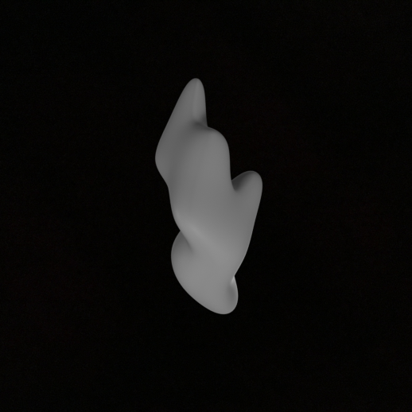
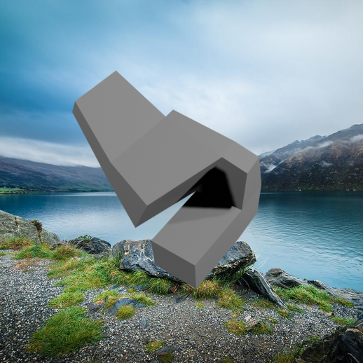
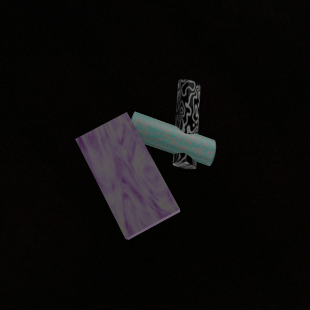
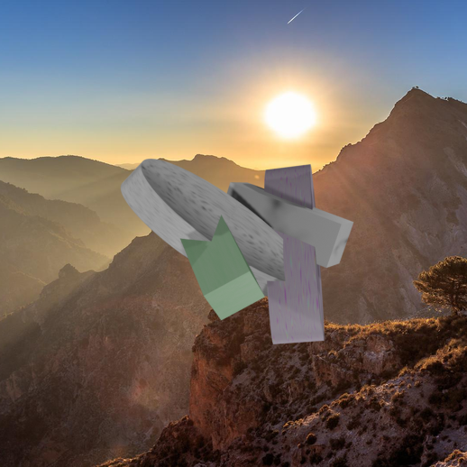
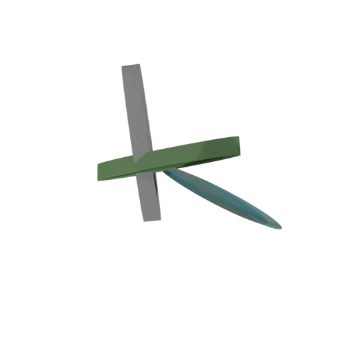

# Human Inspired Data Augmentations (HIDA)

A unified PyTorch training pipeline for visual similarity learning with HIDA datasets.

## Examples of procedurally generated objects

# Shapegen
<p align="center">
  
  
  
</p>

# Primigen
<p align="center">
  
  
  
</p>

> *"Treat nature by means of the cylinder, the sphere, the cone, everything brought into proper perspective."*
> **Paul Cézanne**

Supports two training modes:
- **Contrastive Learning**: Triplet-based training with various loss functions
- **Siamese Learning**: Binary similarity prediction with frozen or unfrozen backbone

## Quick Start

1. **Install dependencies:**
```bash
pip install -r requirements.txt
```

2. **Configure your training:**
Edit `config.yaml` to set your dataset paths, training mode, and parameters.

3. **Run training:**
```bash
python train.py
```

## Project Structure

```
hida-tune/
├── config.yaml                      # Main configuration file
├── train.py                         # Main training script
├── create_csv.py                    # Dataset generation (Shapegen + Primigen)
├── create_csv_w_Objaverse_co3D.py   # Dataset generation (+ Objaverse + CO3D)
├── HIDA_data_generation/            # Object generation & rendering scripts
│   └── README.md                    # See detailed guide: HIDA_data_generation/README.md
├── datasets/
│   ├── builder.py                   # Dataset builder utilities
│   ├── hida_dataset.py              # Triplet dataset implementation
│   ├── siamese_dataset.py           # Siamese pair dataset wrapper
│   └── mochi_dataset.py             # MOCHI benchmark dataset
├── models/
│   ├── __init__.py                  # Model exports (ContrastiveModel, SiameseContrastiveModel)
│   └── dinov2.py                    # DINOv2 backbone implementation
├── training/
│   ├── trainer.py                   # Training and validation loops
│   └── __init__.py                  # Training function exports
├── evaluation/
│   └── mochi_eval.py                # MOCHI benchmark evaluation
├── utils/
│   ├── losses.py                    # Loss function implementations
│   ├── __init__.py                  # Utility exports
│   └── object_manifest.py           # Object tracking for reproducibility
└── logs/                            # Training logs and checkpoints
```

## Configuration

The main configuration file `config.yaml` contains all training parameters organized into sections:

### Training Mode Configuration
Choose between contrastive and Siamese learning:

```yaml
training:
  # Training mode: "contrastive" or "siamese"
  mode: "siamese"  # or "contrastive"

  batch_size: 32
  epochs: 30

  # Siamese-specific configuration
  siamese:
    freeze_backbone: false      # Freeze DINO backbone (true) or fine-tune (false)
    dropout: 0.2                # Dropout for Siamese network head
    lr: 1e-4                    # Learning rate for Siamese head
    optimizer_type: "adamw"     # Options: "adam", "adamw"
    use_scheduler: true         # Enable learning rate scheduling
    warmup_epochs: 3            # Warmup epochs before cosine annealing
    wandb_project: "Siamese-learning"
```

**Contrastive Mode:**
- Uses triplets (A, A', B) directly
- Applies triplet-based loss functions (oddity, triplet, hinge, multi-similarity)
- Trains embedding space with contrastive objectives

**Siamese Mode:**
- Converts each triplet into 3 pairs: (A, A') positive, (A, B) negative, (A', B) negative
- Uses binary cross-entropy loss for similarity prediction
- Can freeze backbone for efficient linear probing
- 3× more training samples per triplet

### Dataset Generation Configuration
Configure which datasets to use and how to generate them:

```yaml
dataset_generation:
  # Options: "hida", "hida_objaverse", "objaverse"
  dataset_type: "hida_objaverse"
  
  # Regenerate dataset for each epoch (optional, for data diversity)
  regenerate_per_epoch: false
  
  paths:
    # Shapegen dataset paths
    shapegen_black: "/path/to/shapegen/black"
    shapegen_random: "/path/to/shapegen/random"
  
  # Number of triplets per dataset+background combination
  triplets_per_combo: 6666
  
  # Similarity/condition ratios for different datasets
  shapegen_ratios: [0.15, 0.45, 0.40]  # [low, medium, high] similarity
  primigen_ratios: [0.60, 0.25, 0.15]  # [place, warp, config] conditions
  objaverse_ratios: [0.05, 0.20, 0.75] # [low, medium, high] similarity
```

### Model Configuration
Configure the backbone and LoRA settings:

```yaml
model:
  backbone:
    _target_: models.dinov2.DINOv2
    checkpoint: "vit_large_patch14_dinov2"  # or vit_base_patch14_dinov2
  
  # LoRA fine-tuning configuration
  use_lora: true
  lora_r: 8
  lora_alpha: 8
  lora_dropout: 0.1
```

### Loss Configuration
Choose and configure your loss function:

```yaml
loss:
  # Options: "triplet", "hinge", "multi_similarity", "oddity"
  type: "oddity"
  
  # Loss-specific parameters
  margin: 0.1        # For triplet/hinge loss
  temperature: 0.1   # For oddity loss
  
  # Multi-similarity loss parameters
  alpha: 2
  beta: 50
  base: 1
```

### Data Augmentation Configuration
Control augmentations applied during training:

```yaml
augmentation:
  enabled: true
  save_every_n: 1000  # Save augmented samples for inspection
  save_dir: "./augmented_samples"
  
  color_jitter:
    brightness: 0.10
    contrast: 0.13
    saturation: 0.1
    hue: 0.05
    probability: 0.5
  
  gaussian_blur:
    kernel_size: 3
    sigma: [0.1, 0.6]
    probability: 0.5
  
```

## Object Generation and Rendering

For detailed instructions on generating and rendering Shapegen and Primigen objects, see:

**[HIDA Data Generation Guide](HIDA_data_generation/README.md)**

The guide covers:
- **Shapegen**: Procedural shape generation with controlled complexity and smoothness
- **Primigen**: Primitive compositions with hierarchical variations (place/warp/config)
- **Rendering**: Multi-viewpoint rendering with configurable lighting
- **Similarity Binning**: How similarity scores are computed and used for triplet selection
- **Complete Workflows**: End-to-end examples for both pipelines

## Dataset Types

### HIDA Dataset (`dataset_type: "hida"`)
- Uses `create_csv.py`
- Combines **Shapegen + Primigen** datasets
- 6 combinations: 3 backgrounds × 2 datasets
- ~1,600 shapegen objects, ~1,620 primigen objects

### HIDA + Objaverse (`dataset_type: "hida_objaverse"`)
- Uses `create_csv_w_Objaverse_co3D.py` with `--no-co3d` flag
- Combines **Shapegen + Primigen + Objaverse**
- 9 combinations: 3 backgrounds × 3 datasets

### HIDA + CO3D (`dataset_type: "hida_co3d"`)
- Uses `create_csv_w_Objaverse_co3D.py` with `--no-objaverse` flag
- Combines **Shapegen + Primigen + CO3D**
- 9 combinations: 3 backgrounds × 3 datasets

### HIDA + Objaverse + CO3D (`dataset_type: "hida_co3d_objaverse"`)
- Uses `create_csv_w_Objaverse_co3D.py`
- All four datasets: **Shapegen + Primigen + Objaverse + CO3D**
- 12 combinations: 3 backgrounds × 4 datasets

### Individual Datasets
- `dataset_type: "objaverse"` - Objaverse only (3 backgrounds)
- `dataset_type: "co3d"` - CO3D only (3 backgrounds)
- `dataset_type: "objaverse_co3d"` - Objaverse + CO3D (6 backgrounds)

### Dataset Characteristics

**Shapegen:**
- Procedurally generated shapes with varying extrusions and smoothness
- Similarity-based triplet selection (low/medium/high bins)
- ~10 viewpoints per object

**Primigen:**
- Primitive compositions with place/warp/config variations
- Condition-based triplets (place, warp, config)
- Structured hierarchy: n-level → config → warp → place
- ~10 viewpoints per object

**Objaverse:**
- Real-world 3D objects from Objaverse dataset
- Similarity-based triplet selection
- 360° viewpoint coverage

**CO3D:**
- Real-world multi-view sequences from CO3D dataset
- Category-based organization
- Multiple frames per sequence

## Architecture Overview

### Training Pipeline

1. **Dataset Generation**: Based on `dataset_type`, generates CSV files with triplet information
2. **Model Creation**:
   - **Contrastive mode**: `ContrastiveModel` with DINOv2 backbone
   - **Siamese mode**: `SiameseContrastiveModel` with DINOv2 + similarity head
3. **Data Loading**:
   - **Contrastive mode**: Loads triplets directly
   - **Siamese mode**: Wraps triplets into pair dataset (3 pairs per triplet)
4. **Training Loop**:
   - Applies augmentations (optional)
   - Computes loss (contrastive or binary cross-entropy)
   - Validates on held-out set
   - Evaluates on MOCHI benchmark
   - Saves checkpoints

### Key Components

#### ContrastiveModel (`models/__init__.py`)
Wraps the DINOv2 backbone for contrastive learning:
- Extracts embeddings from triplet inputs (anchor, positive, negative)
- Supports LoRA fine-tuning for efficient training
- Handles different DINOv2 variants (base/large)
- Forward pass returns (anchor_emb, positive_emb, negative_emb)

#### SiameseContrastiveModel (`models/__init__.py`)
Extends ContrastiveModel with similarity prediction:
- **Backbone**: Frozen or unfrozen DINOv2 for feature extraction
- **Siamese Head**: 3-layer MLP (1024 → 512 → 256 → 1) with dropout
- **Forward pass**: Returns similarity score (0-1) for image pairs
- **Loss**: Binary cross-entropy between predicted and ground truth similarity
- Supports separate learning rates for backbone and head

#### HIDADataset (`datasets/hida_dataset.py`)
PyTorch Dataset for loading triplet data:
- Loads images from CSV triplet definitions
- Applies configurable augmentations during training
- Supports train/val splits with filtering
- Can save augmented samples for inspection

#### Loss Functions (`utils/losses.py`)
Multiple loss function implementations:
- **TripletLoss**: Classic triplet loss with margin
- **HingeLoss**: Hinge-based triplet loss
- **SingleTripletMultiSimilarityLoss**: Multi-similarity loss
- **Oddity_Loss**: Oddity task loss

#### Data Augmentation (`datasets/hida_dataset.py`)
Configurable augmentation pipeline:
- Color jittering (brightness, contrast, saturation, hue)
- Gaussian blur with configurable sigma
- Motion blur with random angles
- Gaussian noise injection

## Dataset Generation Scripts

### create_csv.py
Generates triplets for HIDA dataset (Shapegen + Primigen):
- **Shapegen**: Uses similarity-based triplet selection with 3 bins
- **Primigen**: Uses condition-based triplets (place/warp/config variations)

### create_csv_w_Objaverse.py
Extended version including Objaverse:
- All functionality of `create_csv.py`
- **Objaverse**: Similarity-based triplets with 360° viewpoint selection

### Generated CSV Format
```csv
Trial,BG,A,A_prime,B,DATASET,CONDITION,NAME_A,NAME_B
1,BLACK,/path/to/anchor.png,/path/to/positive.png,/path/to/negative.png,SHAPEGEN,0.750,shape_001,shape_002
```

## Development

### Adding New Loss Functions
1. Implement loss class in `utils/losses.py`
2. Add case to `get_loss_function()` in `train.py`
3. Update config documentation

### Adding New Augmentations
1. Implement augmentation class in `datasets/hida_dataset.py`
2. Add configuration to `DomainRandomizationTransform.__init__()`
3. Update config schema

### Adding New Backbones
1. Implement backbone class in `models/`
2. Update `ContrastiveModel` to support new backbone
3. Add configuration options


